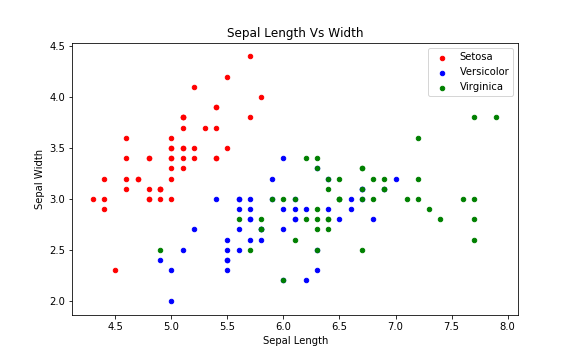
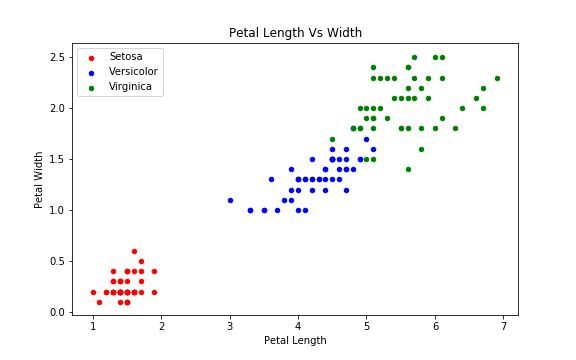

# Iris Dataset
Iris flower dataset has 3 species:
- Setosa
- Versicolor
- Virginica

The iris dataset consists of 4 features:
- Sepal Length
- Sepal Width
- Petal Length
- Petal Width

## Objective: To predict the species given the four features of an iris flower.

### Load the dataset
You can either load it through pandas library or through sklearn library. The sklearn library has the iris dataset in the sklearn.datasets module. I have loaded through pandas library.

```python
import pandas as pd
iris = pd.read_csv('data/iris.csv')
```

### Visualising the data
A scatter plot between the sepal length and sepal width is plotted to visualise the iris dataset.

```python
plt.figure()
fig, ax=plt.subplots(figsize=(8,5))

iris[iris.Species == 'Iris-setosa'].plot(x='SepalLengthCm', y='SepalWidthCm', kind='scatter', label='Setosa',
color='red', ax=ax)
iris[iris.Species == 'Iris-versicolor'].plot(x='SepalLengthCm', y='SepalWidthCm', kind='scatter', label='Versicolor',
color='blue', ax=ax)
iris[iris.Species == 'Iris-virginica'].plot(x='SepalLengthCm', y='SepalWidthCm', kind='scatter', label='Virginica',
color='green', ax=ax)

ax.set_xlabel('Sepal Length')
ax.set_ylabel('Sepal Width')
ax.set_title('Sepal Length Vs Width')
```


In this figure we can see that the seperation of red points(setosa) from the blue(versicolor) and green(virginica) points can be done smoothly. But seperating blue and green points i.e. versicolor and virginica is quite difficult, given the two features sepal available.

Therefore, we will visualise on the other features petal length and petal width as well.

```python
plt.figure()
fig, ax=plt.subplots(figsize=(8,5))

iris[iris.Species == 'Iris-setosa'].plot(x='PetalLengthCm', y='PetalWidthCm', kind='scatter', label='Setosa',
color='red', ax=ax)
iris[iris.Species == 'Iris-versicolor'].plot(x='PetalLengthCm', y='PetalWidthCm', kind='scatter', label='Versicolor',
color='blue', ax=ax)
iris[iris.Species == 'Iris-virginica'].plot(x='PetalLengthCm', y='PetalWidthCm', kind='scatter', label='Virginica',
color='green', ax=ax)

ax.set_xlabel('Petal Length')
ax.set_ylabel('Petal Width')
ax.set_title('Petal Length Vs Width')
```


In this figure decision boundary between versicolor and virginica can be easily determined.

Hence, using all the features for training is a good choice.
